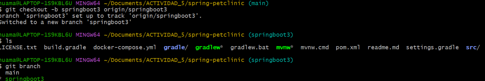
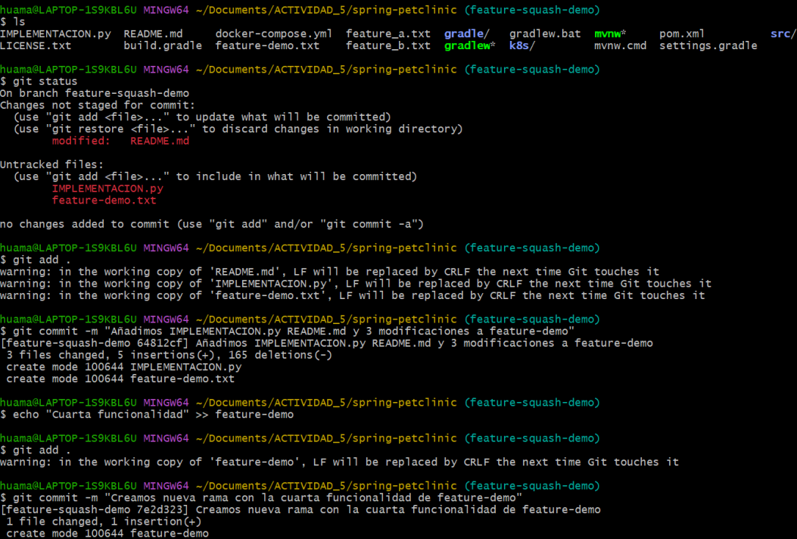
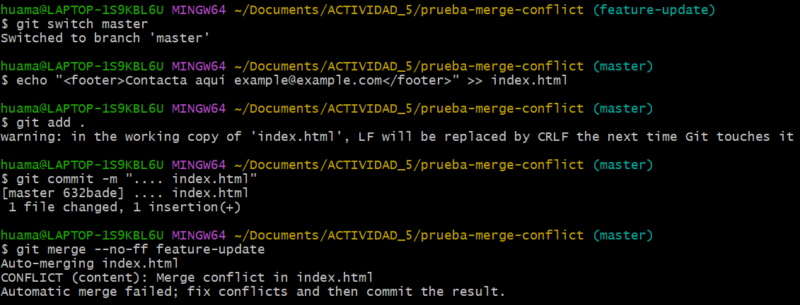

# ACIVIDAD 5
## CLONAR UN REPOSITORIO GIT CON MULTIPLES RAMAS 
Clonar el repositorio de spring projects especificamente spring pet clinic

Extraer de forma local la rama Springboot3

Uso de git merge –ff

Fast Forward no agrega ningun commit del mergeo, dado que main no
tuvo mas commits entonces el HEAD de main ahora apunta al ultimo
commit de Springboot3

Pregunta: ¿En qu´e situaciones recomendar´ıas evitar el uso de git merge –ff?
Reflexiona sobre las desventajas de este metodo.

Answer: No se recomienda cuando se quiere tener un registro de ramas explicito y detallado, cuando se necesita auditar cambios o cuando se hace integracion
continua

## Simula el flujo de trabajo de un equipo
Creación de la rama TEAM A para simular un entorno de trabajo

Merge –no-ff de TEAM A y TEAM B y muetra del tree

## Creación de multiples commits en una rama
Implementacion de una nueva rama llamada feature-squash-demo donde
se haran multiples commit

Realizamos el merge –squeash y dejamos listo en el area de staging

Finalmente realizamos el commit y verificamos el grafo resultante

PREGUNTA: ¿Cuando es recomendable utilizar una fusion squash? ¿Que
ventajas ofrece para proyectos grandes en comparacion con fusiones estandar?
ANSWER: Se recomienda su uso cuando deseamos un historial limpio en
general cuando existen cambios o modificaciones pequeñas que no ameritan su
propio commit o su vision en el historial, tambien se suele usar en el pull request
para un cambio en una rama que se vea como una sola unidad logica

## Resolver conflicto non-fast-forward

Creación del repositorio, añadimos `main.html` en `master` y creamos la rama  
`feature` y sus respectivos commits  

Volvemos a la rama `master` e iniciamos el mergeo con `feature` el cual nos  
mostrará un conflicto  

Abrimos el archivo en conflicto y resolvemos manualmente el conflicto  
seleccionando los cambios que queremos mantener  

Una vez resuelto el conflicto, añadimos los cambios con `git add` y hacemos  
el commit del merge exitoso  

### PREGUNTA: ¿Qué pasos adicionales tuviste que tomar para resolver el conflicto?  
**ANSWER:**  
Fue necesario abrir el archivo en conflicto para solucionar manualmente un error que Git no puede resolver automáticamente. Finalmente, el merge fue hecho.

---

## Comparar los historiales con git log después de diferentes fusiones

Creamos las ramas `feature-1` y `feature-2` y realizamos sus respectivas modificaciones  

Realizamos el merge de `feature-1` y `feature-2`, resolviendo cualquier conflicto si aparece  

Mostramos gráficamente los diferentes tipos de logs utilizando:  
`git log --oneline`  
`git log --graph`  
`git log --all`  

---

## Usando fusiones automáticas y revertir fusiones

Agregamos las líneas 1 y 2 en el archivo `main` desde la rama `master`  

Creamos la rama `auto-merge` y agregamos la línea 3 en el archivo  

Aplicamos el merge automático en `main` con la rama `auto-merge`  
usando `git merge auto-merge`  

Revertimos el último commit (que fue una fusión) usando `git revert -m 1 <hash>`  
para deshacer la fusión  

### PREGUNTAS:  
**¿Cuándo usarías un comando como `git revert` para deshacer una fusión?**  
**¿Qué tan útil es la función de fusión automática en Git?**

**ANSWERS:**  
Usarías `git revert` para deshacer una fusión cuando quieras deshacer los efectos de una fusión específica sin alterar el historial de commits.  
La fusión automática en Git es muy útil para integrar cambios de diferentes ramas cuando no hay conflictos, ya que permite combinar fácilmente el trabajo sin intervención manual.

