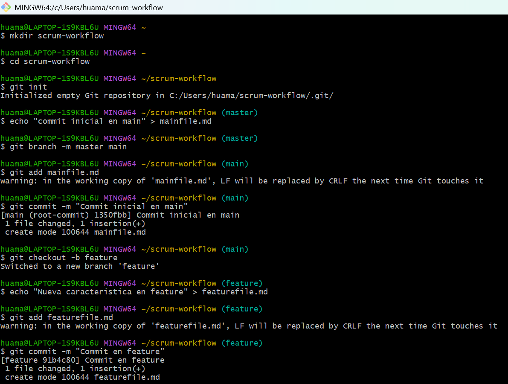
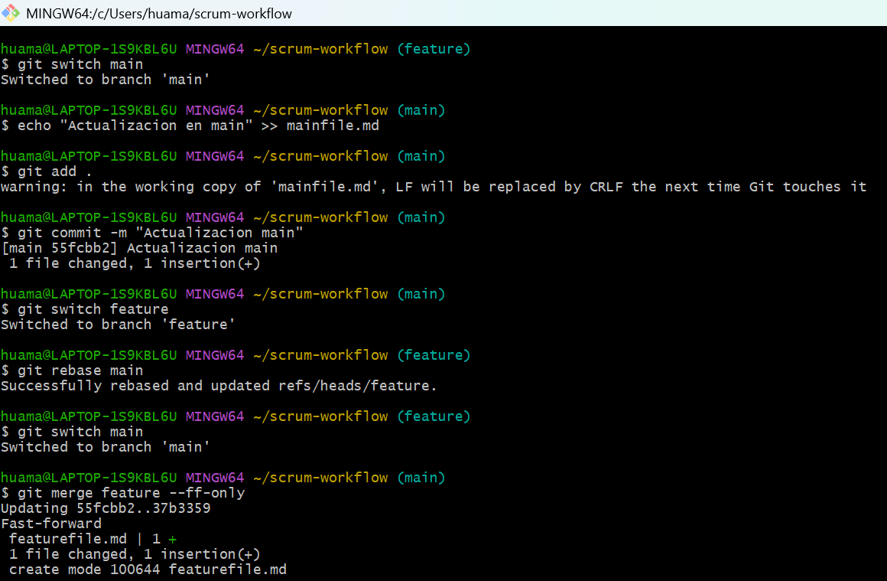
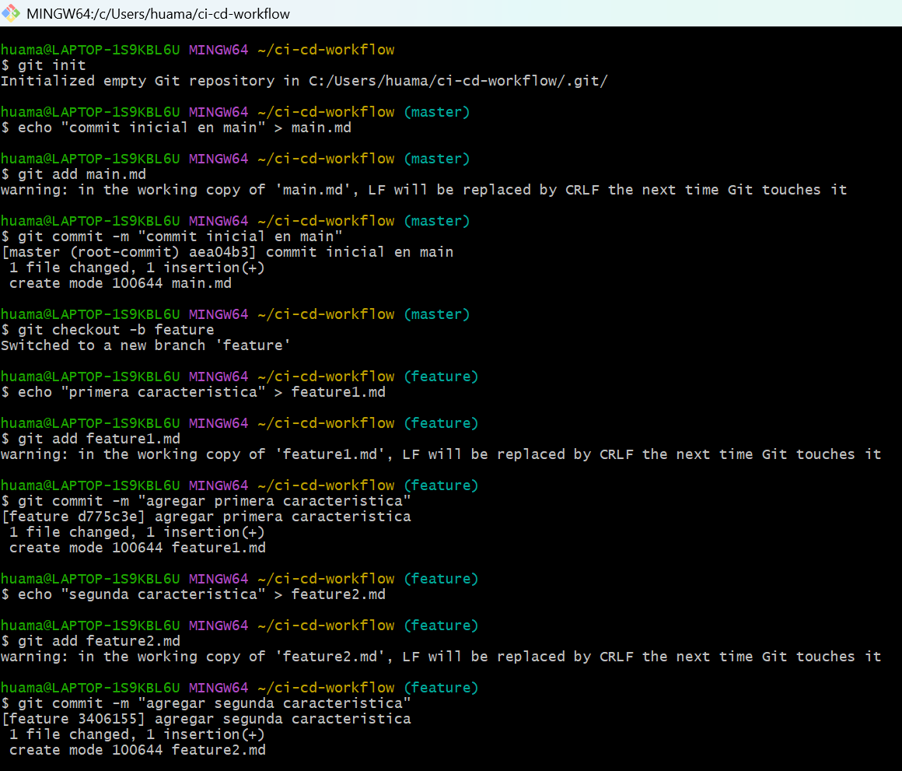
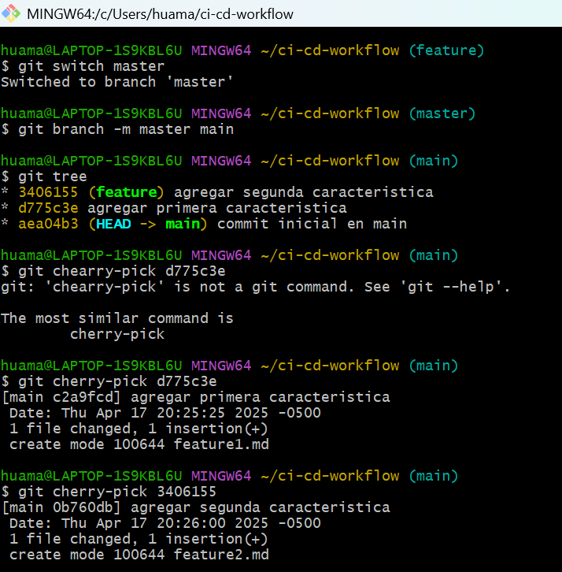
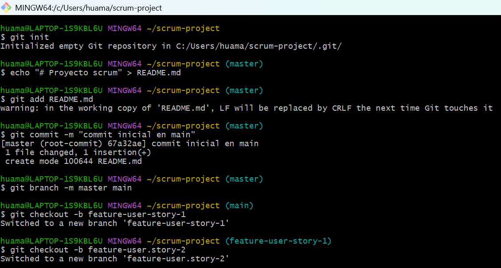
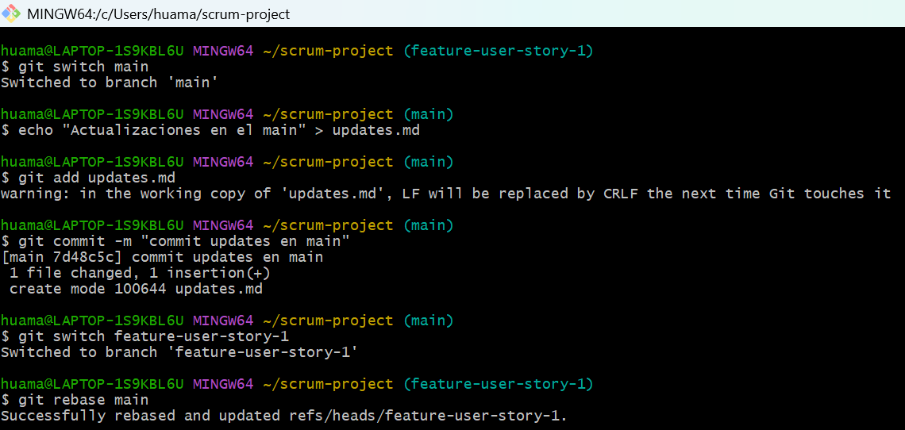
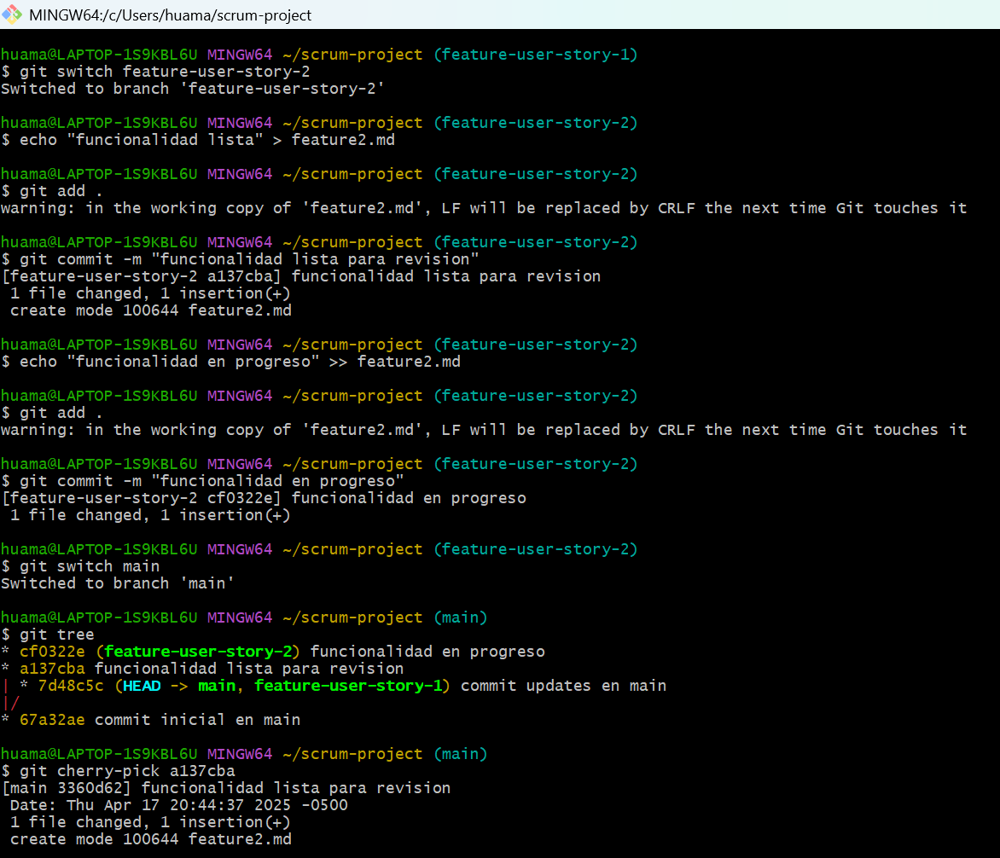
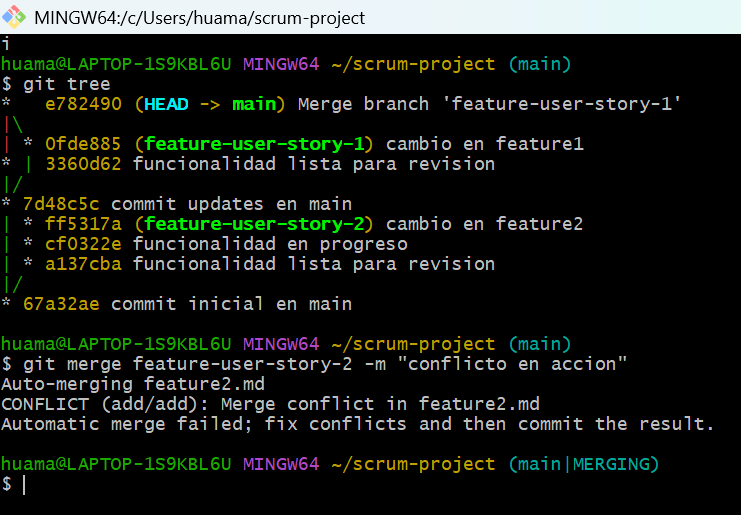
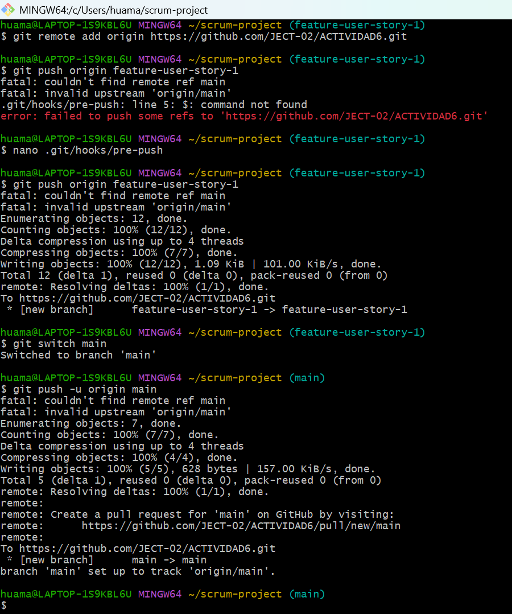

# ACTIVIDAD 6
## PREGUNTAS DE DISCUSION
- ¿Por qué se considera que rebase es más útil para mantener un historial de proyecto lineal en comparación con merge?
  
  Porque reaplica los commits dircetamente sobre una rama base evitando los commits que genera un merge eliminando bifurcasiones en el historial
- ¿Qué problemas potenciales podrían surgir si haces rebase en una rama compartida con otros miembros del equipo?

  Al hacer `rebase` los commit obtendran nuevos hashes ya que se reescriben, en caso algun colaborador escribe sobre los commits originales se generaran conflictos de sincronizacion
- ¿En qué se diferencia cherry-pick de merge, y en qué situaciones preferirías uno sobre el otro?

  `Merge` integra todo el historial desde otra rama mientras que `chearry-pick` copia commits sin importal el historial.
  En general se usa `chearry-pick` cuando se necesita llevar solo ciertos cambios de otra rama sin mexclar toda su historia y `merge` cuando se quiere combinar ramas completas incluyendo toda su historia
- ¿Por qué es importante evitar hacer rebase en ramas públicas?

  Porque `rebase` reescribe toda la historia, si alguien mas ya ha basado trabajo en esa historia (commits) causara divergencias y conflictos a la hora de sincronizar, especialmente si ambos modifican la msima parte del codigo

## EJERCICIOS TEORICOS

- Diferencias entre git merge y git rebase  
Explica la diferencia entre git merge y git rebase y describe en qué escenarios sería más adecuado utilizar cada uno en un equipo de desarrollo agil que sigue las practicas de Scrum.

  git merge se usa para juntar dos ramas y mantiene el historial tal cual, se genera un commit extra que indica que hubo una union. en cambio git rebase mueve tus commits y los pone como si hubieran salido directo desde otra rama, lo que hace que el historial se vea mas limpio. en equipos scrum normalmente se usa merge cuando varias personas estan colaborando y ya compartieron ramas, y rebase puede servir cuando quieres dejar todo ordenado antes de subir tu trabajo, pero siempre que no estes tocando commits que ya subiste o que otros usaron

- Relacion entre git rebase y DevOps  
¿Como crees que el uso de git rebase ayuda a mejorar las practicas de DevOps, especialmente en la implementacion continua (CI/CD)? Discute los beneficios de mantener un historial lineal en el contexto de una entrega continua de codigo y la automatizacion de pipelines.

  rebase ayuda bastante en devops porque mantiene la historia del repo ordenada, y eso en ci/cd es clave ya que hay pipelines que leen los commits para hacer despliegues automaticos, revisar errores o generar reportes. Si el historial esta muy enredado es mas complicado seguir el rastro de lo que se hizo. en cambio con un historial lineal es mas facil detectar donde hubo problemas, entender los cambios y automatizar tareas sin tantas excepciones

- Impacto del git cherry-pick en un equipo Scrum  
  Un equipo Scrum ha finalizado un sprint, pero durante la integracion final a la rama principal (main) descubren que solo algunos commits especificos de la rama de una funcionalidad deben aplicarse a produccion. ¿Como podria ayudar git cherry-pick en este caso? Explica los beneficios y posibles complicaciones

  cherry-pick sirve justo para eso, te permite agarrar uno o varios commits especificos de otra rama y copiarlos a main sin tener que traer todo. si solo una parte de la funcionalidad esta lista, podrian cherry-pickear esos commits puntuales. lo bueno es que no mezclas codigo incompleto, pero hay que tener cuidado porque si esos commits dependen de otros que no estas trayendo puede romperse algo o generar conflictos. asi que es util pero hay que revisar bien lo que estas moviendo

## EJERCICIO PRACTICOS

### 1. Simulación de un flujo de trabajo Scrum con git rebase y git merge
Creacion de las ramas main y feature con sus respectivos commits

Se realiza un rebase de manera que la rama feature ahora inicia desde el ultimo commit de main y finalmente un merge `--ff-only`

### 2. Cherry-pick para integración selectiva en un pipeline CI/CD
Creacion de las ramas main y feature con sus respectivos commits (comandos de la actividad)

Uso de `cherry-pick` para añadir en la direccion de head es decir main los cambios de feature1 y feature2 como un nuevo commit, es decir añade los cambios de ambos commits en la direccion de head

### 3. Git, Scrum y Sprints
Fase 1: Planificación del sprint (sprint planning)

Fase 2: Desarrollo del sprint (sprint execution)

Fase 3: Revisión del sprint (sprint review)

Fase 4: Retrospectiva del sprint (sprint retrospective)

Fase 5: Fase de desarrollo, automatización de integración continua (CI) con git rebase

  
